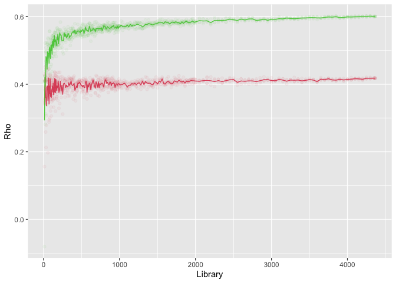

<!-- README.md is generated from README.Rmd. Please edit that file -->

# fastEDM 

<!-- badges: start -->

[](https://lifecycle.r-lib.org/articles/stages.html#experimental)
[](https://CRAN.R-project.org/package=fastEDM)
<!-- badges: end -->

The fastEDM package implements a series of tools that can be used for
empirical dynamic modeling. The core algorithm is written in C++ to
achieve a reasonable execution speed.

## Installation

You can install the development version of fastEDM from
[GitHub](https://github.com/) with:

``` r
# install.packages("devtools")
devtools::install_github("EDM-Developers/fastEDM")
```

## Example: Chicago crime levels and temperature

This example, looking at the causal links between Chicago’s temperature
and crime rates, is described in full in our
[paper](https://jinjingli.github.io/edm/edm-wp.pdf):

``` r
library(fastEDM)
library(ggplot2)
library(readr)
library(tidyr)

data <- url("https://raw.githubusercontent.com/EDM-Developers/EDM/master/test/chicago.csv")
chicago <- read_csv(data, col_types = cols(crime = col_double()))

libs <- c(seq(10, 200, 5), seq(210, 1000, 10), seq(1020, 2000, 20),
          seq(2050, 4350, 50), 4365)

res1 <- edm(chicago["t"], chicago["temp"], chicago["crime"],
                       E=7, library=libs, numReps=4, verbosity=0, numThreads=4)

res2 <- edm(chicago["t"], chicago["crime"], chicago["temp"],
                       E=7, library=libs, numReps=4, verbosity=0, numThreads=4)

averaged1 <- stats::aggregate(rho ~ library, res1$summary, mean)
averaged2 <- stats::aggregate(rho ~ library, res2$summary, mean)

averaged <- data.frame(Library = averaged1$library,
                       temp.to.crime = averaged1$rho,
                       crime.to.temp = averaged2$rho)

combined <- gather(averaged, key = "Direction", value = "Correlation", -Library)
combined[combined$Direction == "temp.to.crime", "Direction"] <- "Crime | M(Temperature)"
combined[combined$Direction == "crime.to.temp", "Direction"] <- "Temperature | M(Crime)"

p <- ggplot(combined, aes(x = Library, y = Correlation)) + 
  geom_line(aes(color = Direction)) + scale_color_manual(values = c("darkred", "steelblue")) +
  geom_point(data = res1$summary, aes(x = library, y = rho), alpha = 0.05, color = "darkred") +
  geom_point(data = res2$summary, aes(x = library, y = rho), alpha = 0.05, color = "steelblue") +
  ylim(c(0.275, 0.625))

print(p)
#> Warning: Removed 4 rows containing missing values (geom_point).
#> Warning: Removed 1 rows containing missing values (geom_point).
```


